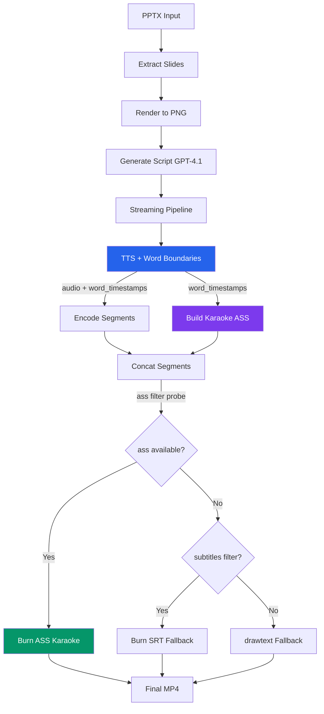
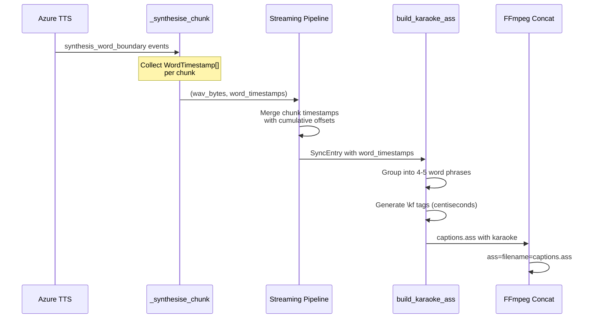

# Fix FFmpeg Portability + TikTok-Style Word-Synced Karaoke Captions

## Diagnosis

### Issue 1: `[AVFilterGraph] No such filter: 'ass'`

The crash occurs because the FFmpeg binary that ran was **compiled without `--enable-libass`**. Looking at the error's configuration line:

```
--extra-cflags=-I/usr/lib/x86_64-linux-gnu/codecs-extra/include
--extra-ldflags=-L/usr/lib/x86_64-linux-gnu/codecs-extra/lib
```

This is a **Debian/Ubuntu `codecs-extra` sidecar FFmpeg** — a different binary from the Fedora system FFmpeg (`/usr/bin/ffmpeg` with `--enable-libass`). The code resolves FFmpeg via:

```python
_FFMPEG_CMD = os.environ.get("FFMPEG_BIN", "ffmpeg")
```

If `PATH` ordering, a container layer, or the streaming pipeline's `ProcessPoolExecutor` (which inherits a different env in `spawn` context) picks up the wrong binary, the `ass` filter silently disappears. The code has **zero runtime validation** — it blindly assumes the filter is available.

> [!IMPORTANT]
> Testing now with the current system FFmpeg confirms `ass` works fine. The root cause is **no capability probing at startup**, making the engine fragile across deployments.

### Issue 2: Static Captions (Not Synced to Speech)

The current caption system is fundamentally static:

```python
# captions.py: one Dialogue event per slide, entire narration shown at once
Dialogue: 0,0:00:00.00,0:00:36.99,Default,,0,0,0,,{entire slide narration}
```

Each slide dumps the **full paragraph** on screen for 20-40 seconds. This is unwatchable — no word follows the speech, no highlighting, no motion. It's the opposite of TikTok-style captions where words appear and highlight in real-time as they're spoken.

---

## Proposed Changes

### Component 1: FFmpeg Runtime Capability Probing

#### [MODIFY] [composer.py](file:///home/newton/ppt-video-engine/engine/composer.py)

Add a startup probe that validates FFmpeg capabilities at import time and provides clear diagnostic errors:

- Add `_probe_ffmpeg()` function that runs `ffmpeg -filters` and checks for `ass`, `subtitles`, and `drawtext` availability
- Store the result in a module-level `_FFMPEG_CAPABILITIES` dict
- In `_concat_segments`, check capabilities before attempting the `ass` filter
- If `ass` is not available, **fall back to `subtitles` filter** (which uses `libass` but accepts SRT), and if that's also missing, fall back to `drawtext` (always available, font-based rendering)
- Log a clear warning when falling back, not a silent failure

```python
# Fallback chain: ass → subtitles (SRT) → drawtext → no captions (warning)
```

---

### Component 2: Word-Level Timestamp Extraction from Azure TTS

#### [MODIFY] [tts.py](file:///home/newton/ppt-video-engine/engine/tts.py)

The Azure Speech SDK v1.50.0 already supports `synthesis_word_boundary` events. We need to capture them:

- Define a `WordTimestamp` TypedDict:
  ```python
  class WordTimestamp(TypedDict):
      word: str
      offset_ms: float    # milliseconds from start of this slide's audio
      duration_ms: float  # how long this word takes to speak
  ```

- Modify `_synthesise_chunk` to collect word boundary events via the `synthesis_word_boundary` callback:
  ```python
  word_boundaries: list[WordTimestamp] = []
  
  def _on_word_boundary(evt):
      word_boundaries.append(WordTimestamp(
          word=evt.text,
          offset_ms=evt.audio_offset / 10_000,  # ticks → ms
          duration_ms=evt.duration.total_seconds() * 1000,
      ))
  
  synthesizer.synthesis_word_boundary.connect(_on_word_boundary)
  ```

- Update `_synthesise_chunk` return type: `tuple[bytes, list[WordTimestamp]]` — returns both the WAV data and the word timestamps
- Update `_concat_wavs` to offset word timestamps for subsequent chunks (cumulative audio offset)
- Update `_run_synthesis_task` return type: `tuple[int, str, list[WordTimestamp]]`

#### [MODIFY] [sync.py](file:///home/newton/ppt-video-engine/engine/sync.py)

- Add `word_timestamps` field to `SyncEntry`:
  ```python
  class SyncEntry(TypedDict):
      slide_number: int
      image_path: str
      audio_path: str
      duration: float
      word_timestamps: list[WordTimestamp]  # NEW — per-word timing
  ```

#### [MODIFY] [pipeline.py](file:///home/newton/ppt-video-engine/engine/pipeline.py)

- Thread the `word_timestamps` from TTS results into `SyncEntry` objects
- No structural change — just pass the new field through

---

### Component 3: TikTok-Style Karaoke ASS Generation

#### [MODIFY] [captions.py](file:///home/newton/ppt-video-engine/engine/captions.py)

This is the core creative change. Instead of one `Dialogue` per slide, we generate **word-group karaoke events** using ASS `\kf` tags:

**Approach: Chunked Word Groups (3-5 words per caption line)**

1. Take the word timestamps for each slide
2. Group words into display chunks of 3-5 words (natural phrase boundaries)
3. Each chunk becomes one `Dialogue` event with `\kf` karaoke fill tags:

```ass
Dialogue: 0,0:00:00.00,0:00:02.50,Karaoke,,0,0,0,,{\kf35}Welcome {\kf28}everyone {\kf42}today {\kf31}we're
Dialogue: 0,0:00:02.50,0:00:04.80,Karaoke,,0,0,0,,{\kf38}going {\kf25}to {\kf45}explore {\kf32}how
```

The `\kf` tag value is the word duration in **centiseconds** — this creates a smooth color sweep across each word as it's spoken (the "TikTok effect").

**Updated ASS Style** — modern, bold, high-contrast, bottom-center:

```
Style: Karaoke,Montserrat,52,&H0000FFFF,&H00FFFFFF,&H00000000,&HB4000000,1,0,0,0,100,100,0,0,1,3,1.5,2,30,30,60,1
```

Breakdown:
| Field | Value | Purpose |
|-------|-------|---------|
| Fontname | Montserrat | Modern, bold, TikTok-adjacent |
| Fontsize | 52 | Large, readable on mobile |
| PrimaryColour | `&H0000FFFF` (yellow) | Highlighted (spoken) word color |
| SecondaryColour | `&H00FFFFFF` (white) | Un-spoken word color |
| OutlineColour | `&H00000000` (black) | Readability outline |
| BackColour | `&HB4000000` | Semi-transparent shadow |
| Bold | 1 | Bold weight |
| BorderStyle | 1 | Outline + shadow |
| Outline | 3 | Thick outline for contrast |
| Shadow | 1.5 | Subtle depth |
| Alignment | 2 | Bottom-center |
| MarginV | 60 | Lifted from bottom edge |

**Word-grouping algorithm:**
```python
def _group_words_into_phrases(words: list[WordTimestamp], max_words: int = 5) -> list[list[WordTimestamp]]:
    """Group words into display phrases of max_words, splitting on
    punctuation boundaries when possible."""
```

> [!NOTE]
> If the word timestamps list is empty (e.g., Azure callback failed or was unavailable), we fall back to the existing static caption behavior automatically. This ensures zero regression.

#### [NEW] [engine/captions.py — `build_karaoke_ass()`](file:///home/newton/ppt-video-engine/engine/captions.py)

New public function alongside existing `build_ass()`:

```python
def build_karaoke_ass(
    sync_map: list[SyncEntry],
    output_dir: Path,
    style: CaptionStyle = CaptionStyle.TIKTOK,
) -> Path:
```

---

### Component 4: Caption Style Presets

#### [NEW] [engine/caption_styles.py](file:///home/newton/ppt-video-engine/engine/caption_styles.py)

Extensible style system for different caption aesthetics. This keeps the engine future-proof:

```python
from enum import Enum

class CaptionStyle(Enum):
    TIKTOK = "tiktok"       # Yellow highlight sweep, bold Montserrat, bottom-center
    MINIMAL = "minimal"     # White on dark shadow, clean sans-serif
    BOLD = "bold"           # Large white text with heavy black outline
    PODCAST = "podcast"     # Centered, softer colors, suitable for talking-head

STYLE_REGISTRY: dict[CaptionStyle, str] = {
    CaptionStyle.TIKTOK: "Karaoke,Montserrat,52,&H0000FFFF,&H00FFFFFF,...",
    CaptionStyle.MINIMAL: "Karaoke,Inter,40,&H00FFFFFF,&H80FFFFFF,...",
    ...
}
```

---

### Component 5: CLI + Composer Integration

#### [MODIFY] [cli.py](file:///home/newton/ppt-video-engine/cli.py)

- Add `--caption-style` option: `tiktok` (default), `minimal`, `bold`, `podcast`, `static`
- When `--captions` is passed, route to `build_karaoke_ass()` instead of the old `build_ass()` (unless `--caption-style static` is chosen)
- The SRT file is still generated for accessibility (soft subtitle track)

#### [MODIFY] [composer.py](file:///home/newton/ppt-video-engine/engine/composer.py)

- The concat step already handles ASS — no structural change needed
- Add the FFmpeg capability probe (from Component 1)
- Ensure `ass=filename=...` uses the correct syntax (already validated)

---

### Component 6: Font Availability

#### [NEW] [engine/fonts.py](file:///home/newton/ppt-video-engine/engine/fonts.py)

Ensure the chosen font (Montserrat) is available at runtime:

- Probe `fc-list` for Montserrat availability
- If missing, fall back to a safe chain: `Montserrat → Arial → Liberation Sans → sans-serif`
- Log a warning if the preferred font isn't found
- Provide a `ensure_fonts()` helper that can be called at startup

---

## Open Questions

> [!IMPORTANT]
> **Font choice**: Montserrat is excellent for TikTok-style but requires installation (`google-fonts-montserrat` or similar). Should we:
> - (A) Auto-download the font to a local cache on first run?
> - (B) Fall back to Arial/Liberation Sans silently?
> - (C) Bundle the font in the repo (it's OFL-licensed, ~500KB)?

> [!IMPORTANT]
> **Caption word-group size**: TikTok typically shows 3-5 words at a time. For presentation narration (which is denser than casual speech), should we:
> - (A) Default to 4-5 words per group?
> - (B) Make it configurable via `--caption-words-per-line`?

> [!IMPORTANT]  
> **Highlight color**: The plan uses yellow (`&H0000FFFF` in ABGR) sweeping over white base text. Should we match a brand color instead, or is yellow the right TikTok-standard choice?

---

## Architecture After Changes



## Data Flow for Word Timestamps



---

## Verification Plan

### Automated Tests
1. **Unit test for word grouping**: Feed known `WordTimestamp` lists → verify phrase groups are 3-5 words, split at punctuation
2. **Unit test for ASS generation**: Feed mock word timestamps → verify `\kf` tags have correct centisecond durations
3. **Unit test for FFmpeg probe**: Mock `subprocess.run` output → verify capability dict
4. **Integration test**: Run the full pipeline on a 2-slide test deck → verify the output video plays with karaoke captions

### Manual Verification
1. Run `python cli.py generate --file mustic.pptx --captions` end-to-end
2. Play the output video and verify words highlight in sync with speech
3. Test on a system without `libass` to confirm the fallback chain works
